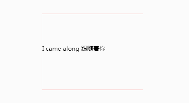

# js简单的文字滚动效果



目前暂未对古老浏览器支持，所以只支持‘现代浏览器’。滚动元素提供了class钩子, 供样式定置化修改。
# 如何使用
## 调用方式
全局引入`rolling.js`
```javascript
<script src="./rolling.js"></script>
```
通过`new Rolling(config)`实例化一个 Rolling 实例：
```javascript
var rolling_config1 = {
  content: '.rolling_1',
  rollingId: 'uop1',
  timeLong: 2500,
  data: [
    '文本1',
    '文本2'
  ]
}
var rolling = new Rolling(rolling_config1)
```
## 参数
new Rolling(config) `config`为配置参数：

| name | value | 备注 |
| ---- | ----- | ---- |
| content | String  | 滚动容器的class/id/name, 需要实现滚动区域的div,不为空 |
| rollingId  | String | 滚动组件唯一ID,为空则内部随机生成 |
| timeLong | Number  | 切换间隔时长,为空则默认值为2500ms  |
| data | Array  | 滚动内容,不为空  |

`rolling`通过`rollingId`来区分实例，所以支持在同一页面创建多个实例：
```javascript
var rolling = new Rolling(rolling_config1)
var rolling2 = new Rolling(rolling_config2)
```
# 示例
[Demo](https://github.com/for7/Plist/blob/7e74b71f1c5c434770f4babb142698ee12d69c17/Demo/rolling/index.html#L51)
# 实现原理

