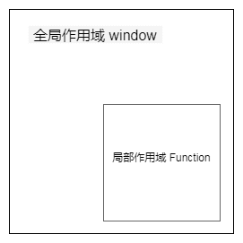
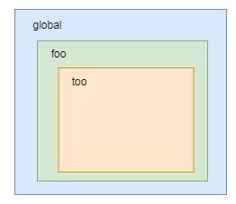

# 将清楚之javascript作用域

标签（空格分隔）： js

---

## 什么是作用域（Scope）？ ##
<<<<<<< HEAD
作用域产生于程序源代码中定义变量的区域，在程序编码阶段就确定了。javascript 中分为全局作用域( `window` )和局部作用域（又称为函数作用域）。简单讲作用域就是当前函数的`生成环境`或者`上下文`（注意：暂且不要与后面讲的`执行上下文`混淆了），包含了当前的可见变量。
javascript 中的作用域：

| 作用域 | - |
| ----- | --- |
| window/global Scope  | 全局作用域  |
| function Scope | 函数作用域 |
| Block Scope  | 块作用域（ES6） |
| eval Scope  |   | |

作用域定义为一套规则，这套规则定义了引擎如何在当前作用域以及嵌套作用域根据标识符来查询变量。反过来说N个作用域组成的作用域链决定了变量能被那些运行环境的代码访问到。

所以我们可以总结为：作用域（Scope）确定了当前环境内定义的变量的可见性，以及在当前环境如何查找上层变量。


=======
作用域产生于程序源代码中定义变量的区域，在程序编码阶段就确定了。javascript 中分为全局作用域(Global context： `window`/`global` )和局部作用域（Local Scope ,  又称为函数作用域 Function context）。简单讲作用域就是当前函数的`生成环境`或者`上下文`（注意：暂且不要与后面讲的`执行上下文`混淆了），包含了当前函数内定义的变量以及对外层作用域的引用。  

javascript 中的作用域：

| 作用域（Scope） | - |
| ----- | --- |
| window/global Scope  | 全局作用域  |
| function Scope | 函数作用域 |
| Block Scope  | 块作用域（ES6） |
| eval Scope  | eval作用域 |

作用域定义了一套规则，这套规则定义了引擎如何在当前作用域以及嵌套作用域根据标识符来查询变量。反过来说N个作用域组成的作用域链决定了函数作用域内标识符查找到的值。

所以我们可以总结为：作用域（Scope）确定了当前上下文内定义的变量的可见性，即更下一层作用域可以访问到。并且作用域链（Scope Chain）也确定了在当前上下文中如何查找标识符的值。


> Scope分为Lexical Scope和Dynamic Scope。Lexical Scope正如字面意思，即词法阶段定义的Scope。换种说法，作用域是根据源代码中变量和块的位置，在词法分析器（lexer）处理源代码时设置。javascript 采用的就是词法作用域。

>>>>>>> 94e734b0578a58bfe6dea4c4830f7c61e8a708d1


变量的访问规则：

- 如果变量 a 在函数内部定义， 则函数内部其他变量具有访问变量 a 的权限，但是函数外部代码没有访问变量 a 的权限。所以同一作用域内变量可以相互访问，即 a、b、c 在同一个作用域他们就可以相互访问。这就像鸡妈妈有宝宝，鸡宝宝可以相互打闹，其他鸡就不能跟他们打闹了，为什么？ 因为鸡妈妈不容许~ o（＾∀＾）o 。

```javascript
let a = 1
function foo () {
    let b = 1 + a
    let c = 2
    console.log(b) // 2
}
console.log(c) // error 全局作用无法访问到 c
foo()
```

- 如果变量 a 在全局作用域下定义（window/global），则全局作用域下的局部作用域内的执行代码或者说是表达式都可以访问到变量 a 的值。局部变量里的同名变量（a）会截断对全局变量 a 的访问。(这里的变量 a 就相当于是饲养员，候饲养员会在合适的时候给鸡儿们投食。但是农场主为了节约成本，规定饲养员要就近给鸡投食，当饲养员1离鸡宝宝更近时其他饲养员就不能千里迢迢跨过鸭绿江去喂鸡了。)

```javascript
let a = 1
let b = 2
function foo () {
    let b = 3
    function too () {
        console.log(a) // 1
        console.log(b) // 3
    }
    too()
}
foo()
```

再次强调 javascript 作用域会严格限制变量的可访问范围: 即根据源代码中代码和块的位置，被嵌套作用域拥有对嵌套作用域的访问权限。(这一条规则说明整个农场是有规则的，不能反向的投食。)


## 作用域链 Scope Chain

**作用域链，是由当前环境与上层环境的一系列作用域共同组成，它保证了当前执行环境对符合访问权限的变量和函数的有序访问。**

上面解释的稍微有些晦涩，对于我这样大脑不好使的就需要在大脑里重复的'读'几次才能明白。那么作用域链是干嘛的？ 简单的说作用域链就是解析标识符的，负责返回表达式执行时所依赖变量的值。再简单点回答：作用域链就是用来查找变量的，作用域链是由一系列作用域串联起来的。

在函数执行过程中，每遇到一个变量，都会经历一次标识符解析过程以决定从哪里获取和存储数据。该过程从作用域链头部，也就是当前执行函数的作用域开始（下图中从左向右），查找同名的标识符，如果找到了就返回这个标识符对应的值，如果没找到继续搜索作用域链中的下一个作用域，如果搜索完所有作用域都未找到，则认为该标识符未定义。函数执行过程中，每个标识符值得解析都要经历这样的搜索过程。


为了具象化分析问题，我们可以假设作用域链是一个数组(Scope Array)，数组成员有一系列变量对象组成。我们可以在数组这个单向通道中，也就是上图模拟从左向右查询变量对象中的标识符，这样就可以访问到上一层作用域中的变量了。直到最顶层（全局作用域），并且一旦找到，即停止查找。所以内层的变量可以屏蔽外层的同名变量。想想一下如果变量不是按从内向外的查找,那整个语言设计会变得N复杂了（我们需要设计一套复杂的鸡宝宝找食物的规则）

还是上面的栗子：

```javascript
let a = 1
let b = 2
function foo () {
    let b = 3
    function too () {
        console.log(a) // 1
        console.log(b) // 3
    }
    too()
}
foo()
```

作用域嵌套结构是这样的：



栗子中，当 javascript 引擎执行到函数 too 时， 全局、函数 foo、函数 too 的上下文分别会被创建。上下文内包含它们各自的变量对象和作用域链（注意： 作用域链包含可访问到的上层作用域的变量对象，在上下文创建阶段根据作用域规则被收集起来形成一个可访问链），我们设定他们的变量对象分别为VO(global)，VO(foo), VO(too)。而 too 的作用域链，则同时包含了这三个变量对象，所以 too 的执行上下文可如下表示：

```javascript
too = {
    VO: {...},  // 变量对象
    scopeChain: [VO(too), VO(foo), VO(global)], // 作用域链
}
```

我们可以直接用`scopeChain`来表示作用域链数组，数组的第一项scopeChain[0]为作用域链的最前端(当前函数的变量对象)，而数组的最后一项，为作用域链的最末端（全局变量对象 window ）。所有作用域链的最末端都为全局变量对象。

再举个栗子：

```javascript
let a = 1
function foo() {
    console.log(a)
}
function too() {
    let a = 2
    foo()
}
too() // 1
```

这个栗子如果对作用域的特点理解不透彻很容易以为输出是2。但其实最终输出的是 1。 foo() 在执行的时候先在当前作用域内查找变量 a 。然后根据函数定义时的作用域关系会在当前作用域的上层作用域里查找变量标识符 a，所以最后查到的是全局作用域的 a 而不是 foo函数里面的 a 。


> 变量对象、执行上下文会在后面介绍。


## 闭包


在 JavaScript 中，函数和函数声明时的词法作用域形成闭包。我们来看个闭包的例子

```javascript
let a = 1
function foo() {
  let a = 2
  function too() {
    console.log(a)
  }
  return too
}
foo()() // 2
```

这是一个闭包的栗子，一个函数执行后返回另一个可执行函数，被返回的函数保留有对它定义时外层函数作用域的访问权。`foo()()` 调用时依次执行了 foo、too 函数。too 虽然是在全局作用域里执行的，但是too定义在 foo 作用域里面，根据作用域链规则取最近的嵌套作用域的属性 a = 2。

再拿农场的故事做比如。农场主发现还有一种方法会更节约成本，就是让每个鸡妈妈作为家庭成员的‘饲养员’， 从而改变了之前的‘饲养结构’。

关于闭包会在后面的章节里也会有介绍。

从作用域链的结构可以发现，`javascript`引擎在查找变量标识符时是依据作用域链依次向上查找的。当标识符所在的作用域位于作用域链的更深的位置，读写的时候相对就慢一些。所以在编写代码的时候应尽量少使用全局代码，尽可能的将全局的变量缓存在局部作用域中。

不加强记忆很容记错作用域与后面将要介绍的执行上下文的区别。代码的执行过程分为编译阶段和解释执行阶段。始终应该记住`javascript`作用域在源代码的编码阶段就确定了，而作用域链是在编译阶段被收集到执行上下文的变量对象里的。所以作用域、作用域链都是在当前运行环境内代码执行前就确定了。这里暂且不过多的展开执行上下文的概念，可以关注后续文章。


> 编译阶段和解释执行阶段会在变量对象一节详细介绍。