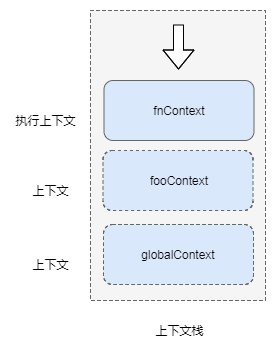

# 讲清楚之执行上下文

标签 :  js

---


# 什么是执行上下文？

当 JavaScript 代码执行一段可执行代码时，会创建对应的上下文(execution context)并将该上下文压入上下文栈（context stack）。

上下文包含以下3个重要属性：

| name | - |
| ---- | - |
| 变量对象(VO, variable object)  | 当前函数定义的变量、函数、参数 |
| 作用域链(Scope chain)  | 源代码定义时形成的作用域链 |
| this  |   ||

抽象理解上下文的代码是这样子的：
```JavaScript
function foo (c) {
  let a = 1
  let b = function () {}
}
// fn函数的上下文
fooContext = {
        VO: {
            arguments: { // 实参
              c: undefind,
              length: 0
            },
            a: 1, // 变量
            b: reference to function (){} // 函数
        },
        Scope: [VO, globalContext.VO], // 作用域链
        this: undefind // 非严格模式下为 this
    }
```

所以上下文是函数运行时的环境或者说是依赖资源的集合，它决定了函数运行时可以获取到哪些变量、函数。

执行上下文（EC）: 如果函数处于正在执行状态则该函数的上下文称为执行上下文。与此同时如果函数处于非执行状态则为（普通）上下文。

上下文栈又称为执行栈（ECS）, 浏览器中 javascript 本身是单线程的，即同一时间只能处理一个上下文及对应的代码段，其他的上下文保存在上下文栈队列里。当有新的函数执行时就会创建一个新的上下文，并将该上下文压入上下文栈顶部，函数执行完后就会被弹出。



javascript以栈的方式管理各个执行单元。页面初始化的时候首先会在栈底压入全局上下文，然后根据特定规则执行到可执行函数时会将该函数的上下文压入`上下文栈` 中， 被压入的上下文包含有该函数运行时所需的资源（变量对象、作用域链、this）。执行上下文可以理解为函数执行时的环境，每当控制器跳转到可执行代码时就会产生一个执行上下文，并且将执行上下文压入栈顶部。同样执行上下文也是一个不可见的概念。


javascript 中有3种运行环境：

- 全局环境： 在浏览器中是`window`, 在 node 环境中是`global`，javascript运行时会首先向执行栈中压入全局环境并，当发现函数等可执行环境时会压入其他上下文；
- 函数环境： 当函数被调用执行时会收集该函数的资源并进入该环境；
- eval环境，弃用

一个运行环境会对应一个执行上下文。位于栈顶的上下文执行完毕后会自动出栈，依次向下直至所有上下文运行完毕，最后浏览器关闭时全局上下文被销毁。为了好理解来举个栗子：

```javascript
let i = 0
function foo () {
    i++
    console.log(i, 'foo')
}
function too () {
    i++
    console.log(i, 'too')
    foo()
}
function don () {
    i++
    console.log(i, 'don')
    too()
}
don()

 // 1 "don"
 // 2 "too"
 // 3 "foo"
```


上面代码的逻辑就是先执行don()，然后是too()、foo()。执行到foo()时的上下文栈是这样的：


# 上下文栈


为了概念化理解执行上下文栈，我们假设浏览器运行时存在一个执行栈队列：`ECStack` ：

```javascript
ECStack = []
```

javascript 载入完成后首先解析执行的是全局代码，所以初始化的时候会向上下文栈中 push 全局上下文，我们用`globalContext`来表示。

```javascript
ECStack = [
    globalContext
]
```

全局作用域在整个代码运行阶段会一直存在，直至页面关闭时 `ECStack` 会被请空，从而`globalContext`则被销毁。

全局上下文创建的时候会进行变量提升、生成变量对象等操作，而后会执行当前上下文中的可执行代码（函数、表达式）。当调用函数的时候会向上下文栈中`push`该函数的上下文。

```javascript
function foo () {
    console.log('foo')
}
function too () {
    console.log('too')
    foo()
}
function don () {
    too()
}
don()
```

执行逻辑可以理解为：
1. 执行到 don(), 解析 don函数内部代码
2. 生成 don 函数的上下文（vo、Scope chain、this）
3. 压入 don 的上下文到 ECStack
4. 执行 don 函数体内部的表达式
5. 执行 too()
6. 生成 too 函数的上下文（vo、Scope chain、this）
7. 压入 too 的上下文到 ECStack
8. ...

不断递归直到 foo 函数执行完...foo 函数上下文被弹出...然后回溯到`globalContext`上下文

执行逻辑的伪代码如下：

```javascript
// 伪代码

// don()
ECStack.push(<don> functionContext);

// 在don中调用了too, push too的上下文到上下文栈里
ECStack.push(<fun2> functionContext);

// 在too中调用了foo， push foo的上下文到上下文栈里
ECStack.push(<fun3> functionContext);

// foo执行完毕, 弹出上下文
ECStack.pop();

// too执行完毕， 弹出上下文
ECStack.pop();

// don执行完毕， 弹出上下文
ECStack.pop();

// 非全局上下文执行完毕被弹出后会一直停留在全局上下文里，直至页面关闭
```

>  上下文是一个运行时概念，函数执行时生成上下文的组成集合。 前文我们讲的作用域是一个静态概念，作用域是根据所在代码片段的位置及词法关系确立的。
