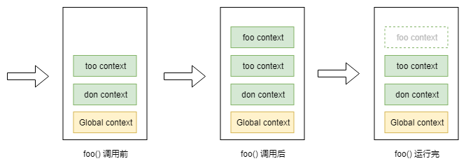

# 讲清楚之执行上下文

标签 :  js

---


# 什么是执行上下文？

当 JavaScript 代码执行一段可执行代码时，会创建对应的上下文(execution context)并将该上下文压入上下文栈（context stack）中。

上下文包含以下3个重要属性：

| name | - |
| ---- | - |
| 变量对象(VO, variable object)  | 当前函数定义的变量、函数、参数 |
| 作用域链(Scope chain)  | 源代码定义时形成的作用域链 |
| this  |   ||

上下文是一个抽象概念，为了便于理解我们假设上下文是一个对象并且包含VO、Scope、this这三个属性：

```JavaScript
function foo (c) {
  let a = 1
  let b = function () {}
}

// foo函数的上下文
fooContext = {
        VO: {
            arguments: { // 实参
              c: undefind,
              length: 0
            },
            a: 1, // 变量
            b: reference to function (){} // 函数
        },
        Scope: [VO, globalContext.VO], // 作用域链
        this: undefind // 非严格模式下为 this
    }
```


所以上下文是函数运行时的环境或者说是依赖资源的集合，它决定了函数运行时可以获取到哪些变量、函数。

执行上下文（EC）: 如果函数处于正在执行状态则该函数的上下文称为执行上下文, 与此同时如果函数处于非执行状态则为（普通）上下文。所以`执行上下文`只是`上下文`的不同状态，本质上它们没有区别。


# 上下文栈

上下文栈又称为执行栈（ECS）, 浏览器中 javascript 解析器本身是单线程的，即同一时间只能处理一个上下文及对应的代码段，所以 javascript 解析引擎使用上下文栈来管理上下文。所有的上下文创建后会保存在上下文栈队列里。栈底为全局上下文，栈顶为当前正在执行的上下文。


一个上下文就是一个执行单元, javascript 以栈的方式管理执行单元。页面初始化的时候首先会在栈底压入全局上下文，然后根据规则执行到可执行函数时会将函数的上下文压入`上下文栈` 中， 被压入的上下文包含有该函数运行时所需的资源（变量对象、作用域链、this），这些资源提供给函数运行时的表达式使用。

执行上下文可以理解为函数运行时的环境。同时执行上下文也是一个不可见的概念。

javascript 中有3种运行环境：

- 全局环境： 在浏览器中是`window`, 在 node 环境中是`global`，当页面初始化时会将全局上下文压入上下文栈；
- 函数环境： 当函数被调用执行时会收集该函数的资源，创建上下文并压入上下文栈；
- eval环境，弃用

一个运行环境会对应一个上下文。位于栈顶的上下文执行完毕后会自动出栈，依次向下直至所有上下文运行完毕，最后浏览器关闭时全局上下文被销毁。为了好理解来举个栗子：

```javascript
let i = 0
function foo () {
    i++
    console.log(i, 'foo')
}
function too () {
    i++
    console.log(i, 'too')
    foo()
}
function don () {
    i++
    console.log(i, 'don')
    too()
}
don()

 // 1 "don"
 // 2 "too"
 // 3 "foo"
```


上面代码的逻辑就是先执行don()，然后是too()、foo()。执行到foo()时的上下文栈是这样的：





我们假设上下文栈为一个数组：`ECStack` ：

```javascript
ECStack = []
```

javascript 载入完成后首先解析执行的是全局代码，所以初始化的时候会向上下文栈中 push 全局上下文，我们用`globalContext`来表示。

```javascript
ECStack = [
    globalContext
]
```

全局作用域在整个代码运行阶段会一直存在，直至页面关闭时 `ECStack` 会被请空，从而`globalContext`则被销毁。

全局上下文创建的时候进行变量提升、生成变量对象等操作，而后会执行当前上下文中的可执行代码（函数、表达式）。遇到函数调用的时候会向上下文栈中`push`该函数的上下文。

```javascript
function foo () {
    console.log('foo')
}
function too () {
    console.log('too')
    foo()
}
function don () {
    too()
}
don()
```

执行逻辑可以理解为：
1. 执行到 don(), 解析 don函数内部代码
2. 生成 don 函数的上下文（vo、Scope chain、this）
3. 压入 don 的上下文到 ECStack
4. 执行 don 函数体内部的表达式
5. 执行 too()
6. 生成 too 函数的上下文（vo、Scope chain、this）
7. 压入 too 的上下文到 ECStack
8. ...

javascript 解析器不断递归直到 foo 函数执行完...foo 函数上下文被弹出...然后回溯到`globalContext`上下文...等待...当事件的回调函数被激活后，执行回调函数。（ 这里涉及到 javascript 的执行机制和事件循环，请关注后续文章^_^）

执行逻辑的伪代码如下：

```javascript
// 伪代码

// don()
ECStack.push(<don> functionContext);

// 在don中调用了too, push too的上下文到上下文栈里
ECStack.push(<fun2> functionContext);

// 在too中调用了foo， push foo的上下文到上下文栈里
ECStack.push(<fun3> functionContext);

// foo执行完毕, 弹出上下文
ECStack.pop();

// too执行完毕， 弹出上下文
ECStack.pop();

// don执行完毕， 弹出上下文
ECStack.pop();

// 非全局上下文执行完毕被弹出后会一直停留在全局上下文里，直至页面关闭
```

>  需要注意的是，上下文与作用域（scope）是不同的概念。上下文是一个运行时概念，浏览器运行后执行 js 代码，将不同的上下文加入上下文栈中，顶层的上下文对应的代码块执行完后又将该上下文销毁。 而作用域是一个静态概念，根据所在代码片段的位置及词法关系确立的，不管浏览器运行与否，源代码的作用域关系、变量的访问权限依然不变。
