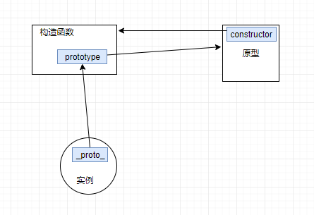
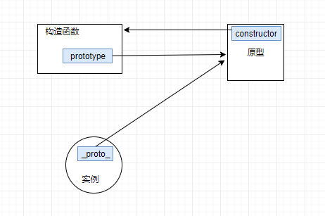
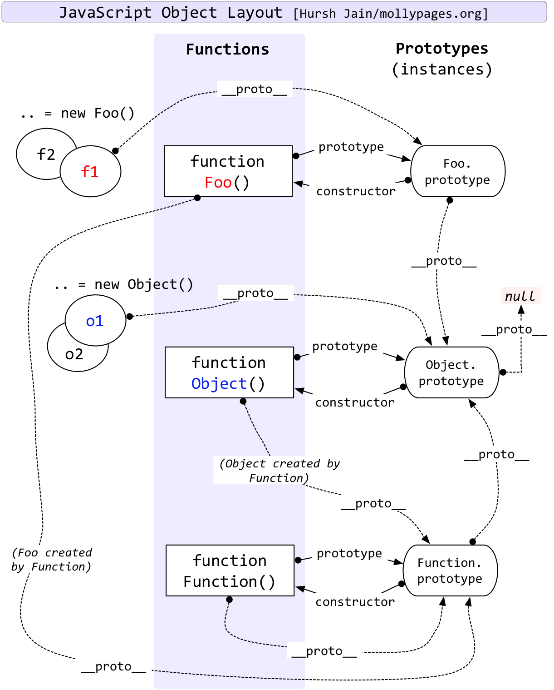

# 讲清楚之javascript原型

标签（空格分隔）： js

---

javascript 中原形是一个比较难于理解的概念。javascript 权威指南在原形这一章也花了大量的篇幅进行介绍，也许你已经读过javascript 权威指南，或者已经是读第N篇了，然而这篇文章的目的就是在读完之后，刨去细枝末节用几分钟梳理一下知识脉络。
# 什么是原型？

在 javascript 中原形是一个对象，通过原形可以实现属性的继承。
```javascript
    let personBase = new Object()
    personBase.gender = '男'
    let animal = {
        eyeNumber: 2
    }
    let time = function () {
        let timeType = 'seconds'
    }
```

上面创建了三个对象，他们可以作为任何函数的原形。

```JavaScript
function Person (age) {
  this.age = age
}
Person.prototype = personBase
let tom = new Person(18)
console.log(tom.age) // 18
console.log(tom.gender) // '男'
```

`personBase` 是 `Person`的原形。 所以构造函数`Person`从`personBase`继承了`gender`属性

原形: 每一个 JavaScript 对象(假设为A，null除外)在创建的时候就会与之关联另一个对象，这个对象就是我们所说的原型，每一个对象都会从原型"继承"属性。

> A，在大多数编码情景中可能是函数。函数默认都继承于`Function`, 即`Function`默认是所有函数的原形。当我们通过`prototype`属性给函数添加一个原形对象时，该原形对象会添加到原形链的`近`端。当然A也可以是其他数据类型（Number、String、Array、Boolean）,例如 Number 类型，当我们通过字面量方式（`var a = 1`）初始化变量等同于通过构造函数方式实例化一个变量（`var a = new Number(1)`），即字面量方式创建的变量同样是`Number`的实例。所以我们可以通过`Number`的`prototype`属性来实现属性和方法的继承。（当然不建议这么做）


# 构造函数、实例、原型之间的关系

弄明白这三者之间的关系关键是理解 `prototype`、`__proto__`、`constructor` 之间的的联系：

| 属性 | - |
| ---- | -- |
| prototype  | 函数属性，指向原型 |
| `__proto__` | 实例属性，指向原型 |
| constructor | 原型属性，指向构造函数 |

在JavaScript中，每个函数都有一个prototype属性，当一个函数被用作构造函数来创建实例时，该函数的prototype属性值将被作为原型赋值给所有对象实例（设置实例的`__proto__`属性），也就是说，所有实例的原型引用的是构造函数的prototype属性。同时在原型对象中，包含一个"constructor"属性，这个属性对应创建所有指向该原型的实例的构造函数（有点拗口，就是`constructor`属性指向构造函数）。这三者的关系可以用下面的示例图表示：



所以构造函数通过 prototype 属性指向自己的原型。 构造函数的实例在创建后通过 `__proto__` 属性指向构造函数的 prototype 的对象，即实例函数也指向原型。构造函数和实例都通过属性指向了原形。

代码示例：

```javascript
    function Person () {}
    let manPerson = new Person()
    manPerson.__proto__ === Person.prototype // true
    Person.prototype.constructor === Person // true
    manPerson.constructor === Person.prototype.constructor // true
```
- `manPerson`是构造函数`Person`的实例
- `manPerson`的`__proto__`属性与`Person`的`prototype`属性保存的值相等，即他们指向同一个对象`原形`。
- Person 的原形（Person.prototype）通过`constructor`属性指向 构造函数 Person ，即 `Person`和他的`原形`实现了相互引用
- 实例的`constructor`属性与原形的`constructor`属性相等。这里实例的`constructor`属性是继承自原形的`constructor`属性。

反过来原型和构造函数是没有指向实例的引用，因为一个构造函数会有N个实例。javascript通过实例的  `__proto__` 属性来访问共同的原形。

> 所有函数都是 Function 构造函数的实例，而且函数也是一个对象
> 同时函数实例的字面量方式创建 function too(){} 等同于构造函数方式创建 let foo = new Function()
```javascript
    foo instanceof Function // true
    too instanceof Function // true
    foo.__proto__ === too.__proto__ // true
    foo.__proto__ === Function.prototype // true foo是Function的实例
```
所以too、foo都是Function的实例，他们的`_proto__`指向的是Function构造函数的原型。

通过上面的示例代码分析，这里主要涉及到 `prototype` 、`__proto__`、`constructor` 这3个属性的关系。

我们再次梳理一下:

- 对于所有的对象，都有`__proto__`属性，这个属性对应该对象的原型
- 对于函数对象，除了`__proto__`属性之外，还有`prototype`属性，**当一个函数被用作构造函数来创建实例时，该函数的`prototype`属性值将被作为原型赋值给所有对象实例（也就是设置实例的__proto__属性）**
- 所有的原型对象都有`constructor`属性，该属性对应创建所有指向该原型的实例的构造函数
- 函数对象和原型对象通过`prototype`和`constructor`属性进行相互关联

所以上面的关系图其实可以于理解为：




----------


题外话：
```javascript
    Function.prototype === Function.__proto__
```
先有鸡还是先有蛋？怎么 Function 作为构造函数 与 Function 作为实例对象的原型相等

> 在JavaScript中，Function构造函数本身也算是Function类型的实例吗？Function构造函数的prototype属性和__proto__属性都指向同一个原型，是否可以说Function对象是由Function构造函数创建的一个实例？
> 相关问题
> [JavaScript 里 Function 也算一种基本类型？][1]
> [在JavaScript中，Function构造函数本身也算是Function类型的实例吗？][2]

对于这类问题也可以不用深究。

----------

# constructor

原型的constructor属性指向对应的构造函数

```javascript
    function Person() {
    }
    console.log(Person === Person.prototype.constructor); // true
```
# 原型链

当理解了原形的概念后，原形链就比较好理解了。

因为每个对象和原型都有原型，对象的原型指向对象的父，而父的原型又指向父的父，这种原型层层连接起来的就构成了原型链。.JavaScript 对象通过`__proto__`指向原型对象的链。原形链的概念不难理解，当访问一个对象的属性时，它不仅仅在该对象上搜寻，还会搜寻该对象的原型，以及该对象的原型的原型，依次层层向上搜索，直到找到一个名字匹配的属性或到达原型链的末尾，找到就返回该属性的值否则就返回`undefind`（原形链的末端是 null）。


关于 javascript 中各数据类型原形之间的关系可以参考下图理解：





[1]: https://www.zhihu.com/question/24804474
[2]: https://www.zhihu.com/question/31333084/answer/152086175
