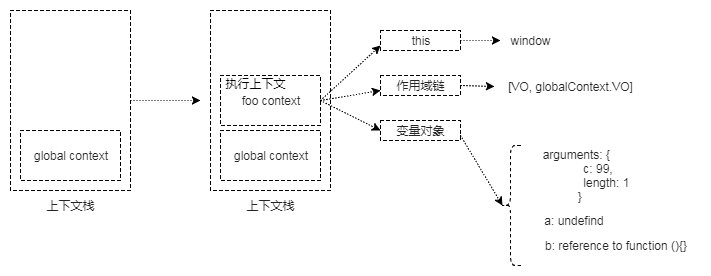
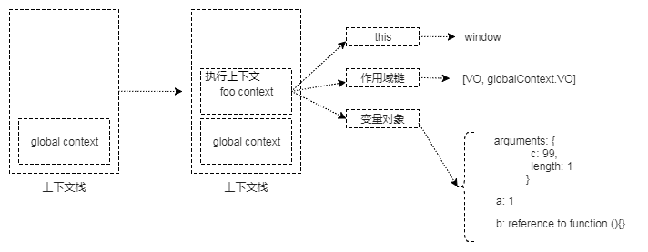

# 变量对象

变量对象是函数运行时数据的集合，存储了在上下文中定义的变量和函数，不同的函数的变量对象稍有不同。

还是从上下文说起，javascript 引擎执行到函数的时候会向上下文栈中压入一个上下文。
上下文中包含：

| name | - |
| ---- | - |
| 变量对象(VO, variable object)  | 当前函数定义的变量、函数、参数 |
| 作用域链(Scope chain)  | 源代码定义时形成的作用域链 |
| this  |   ||

伪代码：

```javascript
// 全局上下文的伪代码
windowEC = {
    VO: Window,
    scopeChain: {},
    this: Window
}
```

- 作用域链为当前函数提供上层可访问变量和函数的有序集合；
-  this为函数提供运行时对象环境；
- 变量对象提供当前函数定义时的变量和函数；

上下文生成时包含的`作用域链`的形成，和`this`的指向原则在前面的章节已经梳理过。
javascript 中主要有全局上下文、函数上下文。先了解一下函数调用时上下文栈的变化。


# 上下文栈状态

当函数被调用的时候，一个新的上下文会被加入到`上下文栈`的顶部, 而后会运行函数内部的代码块。

所以一个执行上下文或者说函数的生命周期分为上下文创建阶段、函数运行阶段，不同阶段上下文栈状态和变量对象属性会不一样。

示例代码：

```javascript
function foo (a) {
    var b = 1
    function c () {
        console.log(a + b) // 100
    }
    c()
}
foo(99)
```

## 执行上下文创建阶段

在这个阶段上下文对象会生成，并创建变量对象、创建作用域链、确定 this 的指向。

说一千道一万还不如来张图干脆。

foo 函数上下文创建完成后的栈状态示意图：



注意：这个时候函数内表达式和语句未执行，变量对象属性值是根据规则被设置为初始值的。

## 运行阶段

上下文生成完成后，进入函数运行阶段。依次按照代码顺序执行函数内代码（变量的赋值、表达式计算、语句的执行，其他函数调用等）。

在该阶段会访问或设置变量对象（活动对象）属性的值。当执行完 foo 函数内第一行代码`var b = 1`，此时栈状态:



以此类推，每次函数表达式执行时都会在执行上下文长中获取`标识符`的值，通过运算后又将结果保存在指定的`标识符`里。因此执行上下文为函数提供一个类似于寄存器的概念来管理数据的功能。

当函数执行完后，对应的执行上下文被销毁。JavaScript 执行器会返回`父函数`或依据源代码顺序跳转到其他函数。


# 函数上下文

在函数上下文中，我们用活动对象(activation object, AO)来表示变量对象。

活动对象和变量对象其实是一个东西，只是变量对象是规范上的或者说是引擎实现上的，不可在 JavaScript 环境中访问，只有到当进入一个执行上下文中，这个执行上下文的变量对象才会被激活，所以才叫 activation object ，而只有被激活的变量对象，也就是活动对象上的各种属性才能被访问。

活动对象也是在进入函数上下文时刻被创建的，`活动对象`是`变量对象`的一种激活状态。所以当你把`变量对象`和`活动对象`记混淆了不要紧，因为他们本质上对我们理解函数调用时的细节没有影响。我在大多数时候也直接用`变量对象`来表述。

## 变量对象的创建

变量对象的创建主要是进行`标识符`值类型的申明和初始化，遵从下面这3条原则：

1. 生成 arguments 对象。检查当前上下文的形参，生成属性与属性值对象(key: value)
   - 当形参没有被赋值时， 属性值被设置为 undefined
2. 在变量对象上建立函数索引。检查当前作用域定义的 function，在变量对象中以函数名为 key， 以函数所在内存地址为 value 建立索引。
   - 如果函数名已经在变量对象中，则该函数名对应的函数会被新的函数替换。所以函数可以被重复定义，后定义的函数会覆盖掉先前定义的。
3. 申明变量。检查当前作用域定义的变量，在变量对象中以变量名为 key， 以 undefined 为值挂载内部变量。
   - 如果新申明的变量名与已经申明的形参名、函数名相同，则申明会被抛弃。

所以需要注意的是函数申明比变量申明优先级高，一旦函数申明占用了某一个标识符，后续的变量申明如果使用的是先前使用过的函数标识符， 则该变量申明无效。

栗子1：

```javascript
function foo () {
    function too() {
    }
    var too
    console.log(typeof too)
}
foo()
// function
// 变量 too 的申明无效
```

我们把上面的栗子稍作修改， 栗子2：

```javascript
function foo () {
    function too() {
    }
    var too = 1
    console.log(typeof too)
}
foo()
// number
// 变量 too 的值类型为 number
```

变量 too 的值类型为 number,  看到这个栗子大家可能会疑惑， 因为根据上面的3条规则， too 的第二次申明应该是无效的且 too 的类型应该为 function。 其实 too 的值类型在上下文创建阶段确实是 function， 由于 javascript 是动态弱类型语言， 在上下文执行阶段 `var too = 1` 实质是在给 too 赋值并且发生了隐式类型转换， 所以在执行阶段 too 变成了 number 类型。es6 语法中已经不建议使用`var` 来申明变量了， 而是使用`let` 来申明局部变量，从语法层面强制避免了重复的变量申明， 栗子2中的情况会直接报错。

将上面的栗子再次修改，可能就会更清楚了：

```javascript
function foo () {
    function too() {
    }
    console.log(typeof too) // function
    var too = 1
    console.log(typeof too) // number
}
foo()
```

foo 函数运行时会先打印 ‘function’，然后打印 ‘number’。首先表达式`console.log(typeof too)`执行时标识符`too`在上下文创建阶段被初始化为一个函数。`var too = 1`执行后标识符`too`被赋值为 1，所以第二次`console.log(typeof too)`的时候输出的是`number`.

再再举一个例子：

```javascript
function foo () {
    console.log(a)
    console.log(bar)
    var a = 1
    function bar() {
        return 2
    }
}
foo()
// undefind
// ƒ bar() {
//      return 2
//  }
```

上下文创建阶段解析函数内代码块后，会在变量对象上添加 ‘a’， ‘bar’ 两个标识符，并填充相应的值结束上下文的创建阶段进入foo 函数的执行阶段。

在执行阶段 foo 函数体第一行表达式要求打印输出 a 的值， 由于 `console.log(a)` 之前没有对 a 进行任何赋值操作，根据规则此时 a 的值为 `undefind`  所以输出 'undefind'。函数体内第二行要求打印输出 bar 的值，根据规则标识符 'bar' 对应的是函数，所以 'bar' 的值为函数实体，且在 `console.log(bar)` 之前也未对 bar 做赋值操作，所以打印出来的是该函数。

变量对象创建完，函数运行前的变量对象是这样的：

```javascript
// VO 为 Variable Object的缩写，即变量对象
VO = {
    arguments: {...},
    bar: <bar reference>  // 表示bar的地址引用
    a: undefined
}
```

变量对象（活动对象）的创建过程实质上也就是我们经常提起的`函数变量提升`，这里3条原则才是变量提升的本质。

如果没有理解透彻可以回头看看前面的内容。


# 全局上下文

在浏览器中，全局对象就是 window ，也是浏览器提供的预定义变量对象，可以通过 `this`和`self` 引用。全局对象提供浏览器预置对象 Array、Object、console.log、alert 等，全局上下文的生命周期和函数的生命周期一样，只要程序运行不结束全局上下文就一直存在。其他所有的上下文环境，都能直接访问全局上下文的属性。

> 全局对象是预定义的对象，作为 JavaScript 的全局函数和全局属性的占位符。通过使用全局对象，可以访问所有其他所有预定义的对象、函数和属性。在顶层 JavaScript 代码中，可以用关键字 this 引用全局对象。因为全局对象是作用域链的头（最外层作用域），这意味着所有非限定性的变量和函数名都会作为该对象的属性来查询。例如，当JavaScript 代码引用 parseInt() 函数时，它引用的是全局对象的 parseInt 属性。全局对象是作用域链的头，还意味着在顶层 JavaScript 代码中声明的所有变量都将成为全局对象的属性。

通过`this`、`seif`访问全局对象：
```javascript
console.log(this)
console.log(self)
```
