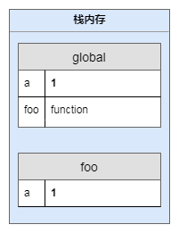
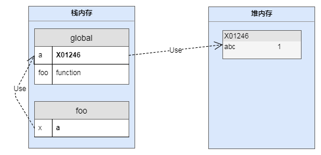

# 参数传值

参数传值是指函数调用时，给函数传递配置或运行参数的行为，包括通过call、apply 进行传值。

在实际开发中，我们总结`javascript`参数传值分为基本数据类型按值传递（String、Numbe、Boolean、Null、undefind），引用数据类型按引用传递(Object, 包括Array、Function、Data)。这篇文章将要纠正这一误解： 实质情况引用类型是按共享传递的。

在探索传值问题前，我们先看一下 javascript 在声明变量是怎样分配内存的

- 原始值：存储在栈（stack）中的简单数据段，也就是说，它们的值直接存储在变量访问的位置。这是因为这些原始类型占据的空间是固定的，所以可将他们存储在较小的内存区域 – 栈中。这样存储便于迅速查寻变量的值。
- 引用值：存储在堆（heap）中的对象，也就是说，存储在变量处的值是一个指针（point），指向存储对象的内存地址。这是因为：引用值的大小会改变，所以不能把它放在栈中，否则会降低变量查寻的速度。相反，放在变量的栈空间中的值是该对象存储在堆中的地址。地址的大小是固定的，所以把它存储在栈中对变量性能无任何负面影响。

基本类型数据是将原始值保存在栈中，应用类型数据是将数据保存在堆中，然后在栈中建立堆地址的引用。在javascript中是不允许直接访问保存在堆内存中的对象的，所以在访问一个对象时，首先得到的是这个对象在堆内存中的地址，然后再按照这个地址去获得这个对象中的值，这就是传说中的按引用访问。而原始类型的值则是可以直接访问到的。不同的内存分配机制也带来了不同的访问机制。

而在复制变量的时候也存在区别：

- 原始值：在将一个保存着原始值的变量复制给另一个变量时，会将原始值的副本赋值给新变量，此后这两个变量是完全独立的，他们只是拥有相同的value而已。
- 引用值：在将一个保存着对象内存地址的变量复制给另一个变量时，会把这个内存地址赋值给新变量，也就是说这两个变量都指向了堆内存中的同一个对象，他们中任何一个作出的改变都会反映在另一个身上。即复制是不会产生新的堆内存消耗。

所以我们总结 javascript 中所有函数参数都是按值传递，都是把形参复制给实参，只是基本数据类型复制的是`原始值`，而引用类型复制的是堆内存的`地址`。

引用类型的这种求值策略就是 [按共享传递(call by sharing)](http://dmitrysoshnikov.com/ecmascript/chapter-8-evaluation-strategy/#call-by-sharing).

理论知识梳理完了，下面举几个例子分析一下具体的情形.

## 基本数据类型传值

```javascript
let a = 1
function foo(x) {
    console.log(x)
}
foo(a)
console.log(a)
// 2
// 1
```

变量` a `的值直接复制到了`foo`函数的实参`x`上，此时变量`x`是变量 a 的一个副本。它们独立的在各自的上下文栈中保存了值‘1’，且相互之间互不影响，我们对 a、x的读写操作，操作的是他们各自的原始值。




如图，在全局上下文和`foo`的上下文中各自保存了值`1`.


## 引用类型传值

```javascript
let a = {
    abc: 1
}
function foo(x) {
    x.abc = 2
    console.log(x.abc)
}
foo(a)
console.log(a.abc)
// 2
// 2
```

根据编码经验我们会很自然的得出，上面的栗子是按引用传递。对象`a`的引用被传递到函数foo内部， 函数内部变量`x`指向全局变量`a`，从而实现了引用的传递，所以变量`x`和变量`a`读写的是同一个对象。我们用一张图来揭示：



但其实是按共享传递。按引用传递是我们对 javascript 求值策略的误解，如果是按引用传递下面这个例子就懵比了：

```javascript
let a = {
    abc: 1
}
function foo(x) {
    console.log(x) // {abc: 1}
    x = 2
    console.log(x) // 2
}
foo(a)
console.log(a.abc) // 1

```

foo 函数执行时第一个打印输出 ‘{abc: 1}’, 第二个打印输出 ‘2’, 调用 foo 函数后的`console.log(a.abc)`一句打印输出‘1’。

按引用传递的话。表达式`console.log(a.abc)`是在 foo 函数执行后执行的，此时的`a`应该已经被赋值为 2, `a.abc`是不存在的应该打印输出 ‘undefind’。 但是却打印输出了 1，说明在 foo 函数的内部执行`x = 2`是并没有修改外层对象 a 的值。

为什么会出现`a`、`x`在指向同一个对象后，对`x`赋值又没有改变原对象的值呢？

因为这里对象传递给实参是按共享传递（call by sharing）的，根据引用类型变量复制的特点：

foo 函数执行时， 形参 x 的值是传进去的对象 a 的内存地址引用，即在变量对象创建阶段`x`保存的是一个对象的堆内存地址。此时 a、x 都指向同一对象。 接着在函数的执行阶段，代码的第二行将原始数据类型 2 赋值给 x，导致 x 不再保存原先的堆内存地址转而保存一个原始值，再次访问 x 的时候是访问对 x 最后一次赋值的原始值。

所以对 x 的赋值会改变上下文栈中标识符 x 保存的具体值

> 此时如果使用的是按引用传递 ，则变量 a 所指向的对象因该被赋值为2。但其实对 x 赋值为一个基本数据类型并没有使原对象为一个字面量值，这就说明引用类型并不是按引用传值，不是遵从按引用规则来处理值的写入。

需要区分给对象属性赋值与直接给对象赋值的区别：

```javascript
let a = {
    abc: 1
}
function foo(x) {
    x.abc = 99
    console.log(x) // {abc: 99}
    x = 2
    console.log(x) // 2
}
foo(a)
console.log(a) // {abc: 99}

```

在 foo 函数内部修改对象 x 的属性，会导致 `x`、`a` 指向的对象被修改，因为它们指向同一个堆地址。


参考：

《javascript高级程序设计》

[javascript传递参](https://www.zhihu.com/question/27114726)

[JS是按值传递还是按引用传递?](http://bosn.me/js/js-call-by-sharing/)
